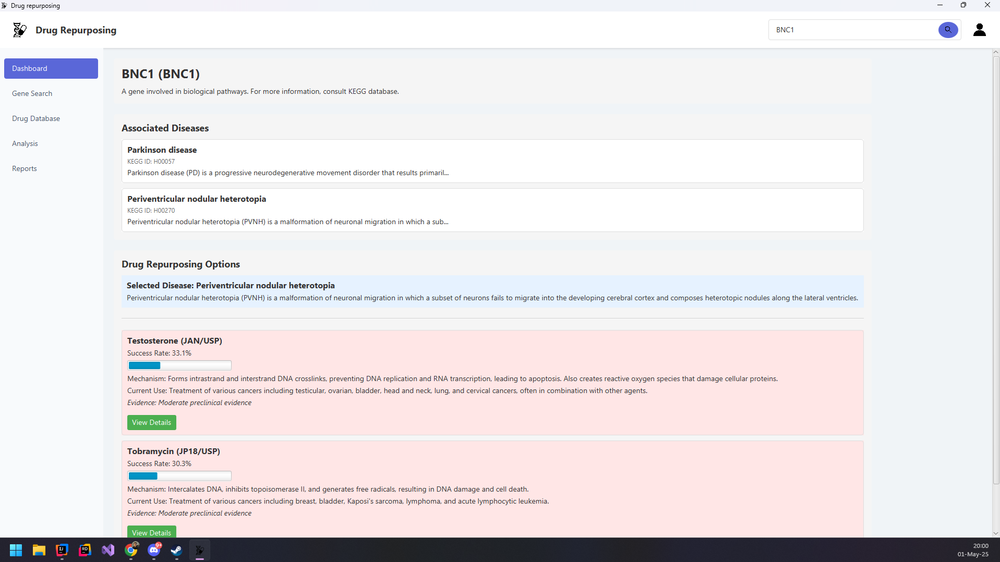

# GeneExplorer

GeneExplorer is a comprehensive JavaFX application that enables exploration of biological pathways, gene-disease relationships, and drug repurposing opportunities. The system integrates with genomic databases to provide insights for researchers and clinicians.

## Features

- **Gene Search and Information**: Search for genes and view detailed information retrieved from KEGG
- **Disease Association**: Discover diseases associated with specific genes
- **Drug Repurposing**: Find potential new applications for existing drugs based on pathway analysis
- **Pathway Visualization**: Explore biological interaction networks
- **User Authentication**: Create accounts to save search history
- **Data Integration**: Connects to KEGG database for comprehensive biological information

## System Architecture

The application follows a layered architecture:

### Repository Layer
- `GeneDiseaseDrugCompoundRepository`: Handles gene, disease, drug, and compound data access
- `InteractionRepository`: Manages pathway interaction data
- `UserRepository`: Handles user account data with encrypted password storage

### Service Layer
- `GeneDiseaseDrugCompoundService`: Business logic for biological entity operations
- `InteractionService`: Handles pathway interactions 
- `UserService`: Manages authentication and user operations
- `AllServices`: Aggregates all services for easier access

### UI Layer
- JavaFX-based user interface with CSS styling
- Dialog-based auth system
- Interactive visualizations for pathway data

## Database Schema

The SQLite database contains the following key tables:
- `Gene`/`GeneAliases`: Gene information and alternative names
- `Disease`/`DiseaseAliases`: Disease information and alternative names
- `Drug`/`DrugAliases`: Drug information and alternative names
- `Compound`/`CompoundAliases`: Compound information and alternative names
- `Interaction`: Defines relationships between biological entities
- `Pathways`: Biological pathway information
- `GeneDiseases`: Associations between genes and diseases
- `DiseaseDrugs`: Maps diseases to potential drug treatments
- `User`: User account information with encrypted passwords

## Setup and Installation

### Prerequisites
- Java JDK 11 or higher
- SQLite
- Maven

### Installation Steps
1. Clone the repository
2. Configure the database path in `bd.config`
3. Build using Maven: `mvn clean package`
4. Run the application: `java -jar target/GeneExplorer.jar`

## Usage

### Gene Search
Enter a gene name in the search box to view:
- Detailed gene information
- Associated diseases
- Pathway interactions

### Disease Investigation
Select a disease to view:
- Disease details from KEGG database
- Drug repurposing opportunities
- Success rates and evidence levels for potential treatments

### User Account Management
- Create an account to track search history
- View previous searches for quick access
- Customize application settings

## Security Features

- AES encryption for user passwords via `CryptoUtil`
- Input validation to prevent injection attacks
- Exception handling for robust error management

## Technologies Used

- **Java**: Core programming language
- **JavaFX**: UI framework
- **Spring Framework**: Dependency injection
- **SQLite**: Database
- **KEGG REST API**: Biological data source
- **Log4j**: Logging framework

## Future Enhancements

- Integration with additional biological databases
- Advanced visualization tools for pathway analysis
- Export functionality for research reports
- Machine learning for improved drug repurposing predictions
- Collaborative features for research teams

## Contributing

Contributions are welcome! Please feel free to submit a Pull Request.

## License

This project is licensed under the MIT License - see the LICENSE file for details.

---

*Developed as part of a bioinformatics research initiative*
